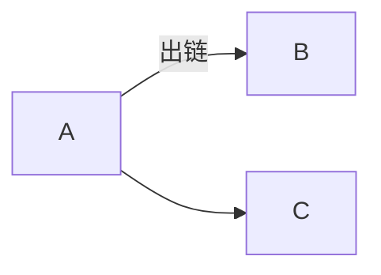

**# 配置

# 双链
可以用大量的链接在知识之间建立联系
## 基础概念
- 入链（反向链接）
- 出链

A是B和C的入链，B、C是A的出链，
### 出链符号（[[]]）
这是一个链接——[[链接样式]]
这是一个链接到的标题1——[[链接样式#标题1]]
这是一个链接到的标题2——[[链接样式#标题2]]
这是一个链接到的文本快——[[链接样式#^906193]]
#### 直接展示链接内容
![[链接样式]]


# MindMap
将笔记大纲导出为思维导图（命令面板搜mind Map），然后可以将思维导图的内容剪切为图片

![[MindMap]]

# Calender
日记插件，右侧栏日记可以查看某一天的日记，或者创建某一天的日记

## 周记
插件设置打开周记，并添加周记的模板和目录，点击右侧栏日记最左侧一栏可以创建或插件周记

# Task

 任务管理插件

命令面板搜索task


# Obsidian Memos

类似Flomo功能，记录一些灵感

会存储在你的日记当中

# Excalidraw

在obsidian中**绘制流程图**

# DataView

## 搜索VS查询

搜索：针对**内容**的查找
查询：针对**属性**的查找

## 搜索技巧
搜索整个资料库：Ctrl / Cmd + Shift + F 
- 搜索技巧
	- 直接搜索关键词
	- 搜索包含多个关键词的文档（空格间隔）
	- 搜索包含某一个关键词的文档 (OR)
	- 指定搜索范围
	- 搜索文件名 file:word
	- 搜索文本内容 content:word
	- 搜索标签 tag:#tag:word
	- 搜索同一行中的多个关键词 line:word1 word2
	- 搜索同一章节中的多个关键词 section:word1  
	    word2
	- 搜索同一段落（块）中的多个关键词 block: wordl  
	    word2
	- 搜索任务
	- 搜索任务 task:""
	- 搜索末完成任务 task-todo:""
	- 搜索已完成任务 task-done:""
- 保存查询结果
	- 代码query
```query
日记 周记
```

## DataView查询

Obsidian资料库 = 一个数据库
查询依据：YAML依据/Metainfo

### YAML
位于Markdown文件开头 ，输入收尾三个-符号

- Obsidian支持的YAML字段
	- tags
	- publish
	- cssclass
	- aliases
- 自定义字段(可以自己定义)
	- category
	- date
	- time
	- rating

### Obsidian文件属性
- file.name:文件标题（字符串）
- file folder：文件所属文件夹路径
- file.path：文件路径
- file.size: (in bytes) 文件大小
- file.ctime：文件的创建时间（包含日期和时间）
- file.mtime：文件的修改时间
- file.cday：文件创建的日期
- file.mday：文件修改的日期
- file.tags：笔记中所有标签数组
- file.etags：除去子标签的数组
- file.inlinks：指向此文件的所有传入链接的数组
- fle.outinks：此文件所有出站的链接数组
- file.aliases：文件别名数组
- file.day：如果文件名中有日期，那么会以这个字段显示。比如文件名中包含yyyy-mm-dd（年-月-日，例如（2021-03-21），那么就会存在这个 metadata。

```dataview
list from "00templates"
```
```dataview
list from #练习 where rating > 3
```

## 使用模板创建Yaml查询
![[template_metainfo_yaml]]

### Yaml完整语法

