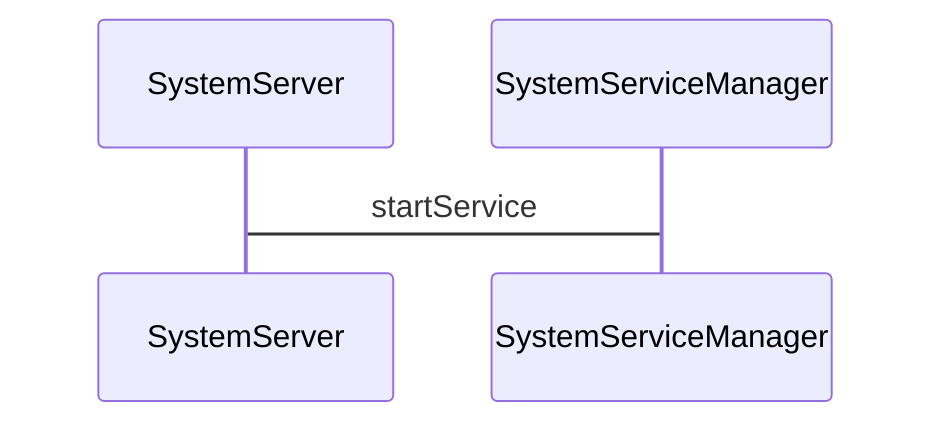

# 开机启动 

# 参考链接

[Android源码解析--ActivityManagerService详解(一)：从开机启动的角度解析AMS](https://blog.csdn.net/qq475703980/article/details/89430111)

[Android 理解 ActivityManagerService（AMS）](https://juejin.cn/post/6991735689788260388#heading-2)
