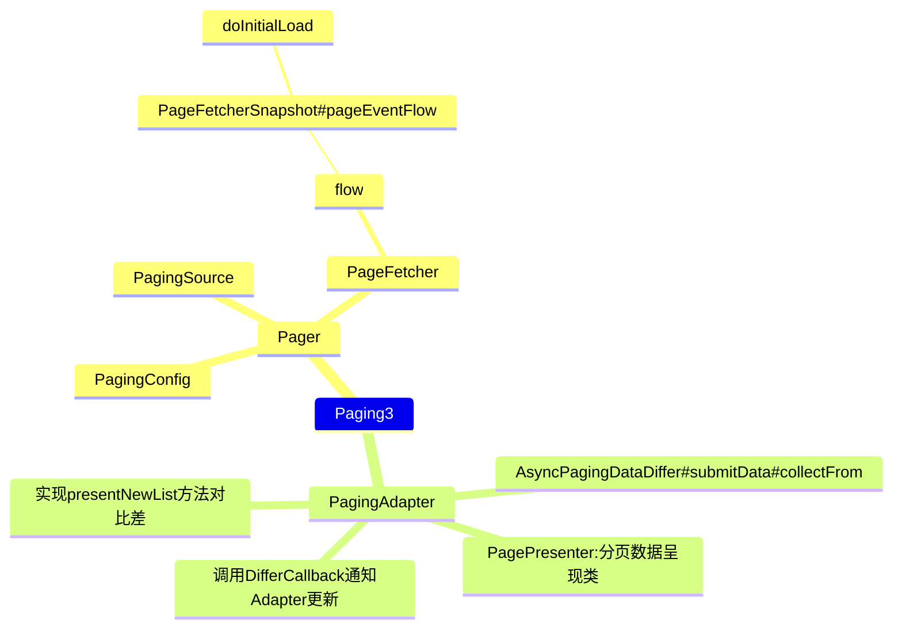

# Pager
- config：PagingConfig
- initialKey：Key
- remoteMediator：RemoteMediator
- pagingSourceFactory：PagingSource

## flow

PageFetcher封装类返回的flow流:
- pagingSourceFactory:
- initialKey: Key
- config: PagingConfig
- remoteMediator: RemoteMediator

# PagingConfig

- pageSize
- prefetchDistance
- enablePlaceholders
- initialLoadSize
- maxSize
- jumpThreshold

# PageFetcher

- refreshEvents: ConflatedEventBus
- retryEvents: ConflatedEventBus

ConflatedEventBus：基于StateFlow流封装的事件总线，PagingSource通过这两个总线来进行数据的刷新和分发。

## flow

采用SimpleChannelFlow封装，这个是一个简单的生产-消费的channel

refreshEvents刷新时会把数据包装成`GenerationInfo`（**这里会调用到
PagingSource的getRefreshKey方法**）
,最终返回PagingData，PagingData供PagingDataAdapter使用

## GenerationInfo

- snapshot:[[#PageFetcherSnapshot]]，
- state:PagingState
- job:Job

## PageFetcherSnapshot

保存可分页数据的生成，核心类

### pageEventFlow

正常的加载分页主要的事件流： 
1. 监听页数据pageEventCh的Channel产生的事件并发送；
2. 监听retryChannel管道产生的事件并发送；
3. 收集retryChannel事件并处理：
	1. 前一个请求必须是Error才能重试；
	2. 在doInitialLoad中调用loadParams方法生成一个类LoadParams类，调用pagingSource的load方法并传入loadParams，并发送返回的结果；
	3. 重试成功后在ViewportHints上处理PREPEND/APPEND的加载；
4. 进行初始化加载doInitialLoad()
5. 初始化成功后开始收集数据

### doInitialLoad()

这个方法会回调PagingSource的load方法，主要是加载分页数据，并处理返回的结果

# PagingData

一次刷新对应单独的一个PagingData容器

- downstreamFlow:如果没有remote参数，那么这个flow就是[[#PageFetcherSnapshot#pageEventFlow]]
- receiver：UIReceiver

# PagingAdapter

## AsyncPagingDataDiffer#submitData

- 调用collectFrom方法，收集pagingData中flow的数据：
	- 如果是刷新：
		- 转换成PagePresenter（列表数据的呈现类）
		- 对比新老列表数据差异；
		- 分发LoadState事件；
		- 根据差异；
	- 否则根据差异对比来增删改查数据，与刷新类似；

## 如何将数据返回到Adapter呢？

- 在刷新时调用presentNewList方法对比差异时，调用DifferCallback的onInserted、onRemoved、onChanged方法
- 在processEvent中回调DifferCallback方法

# 总结

