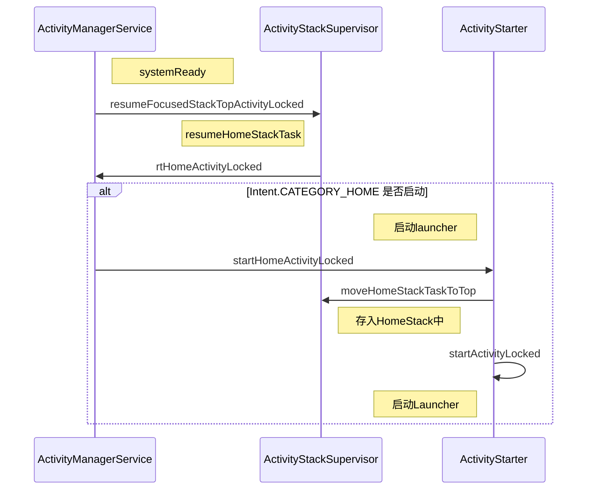
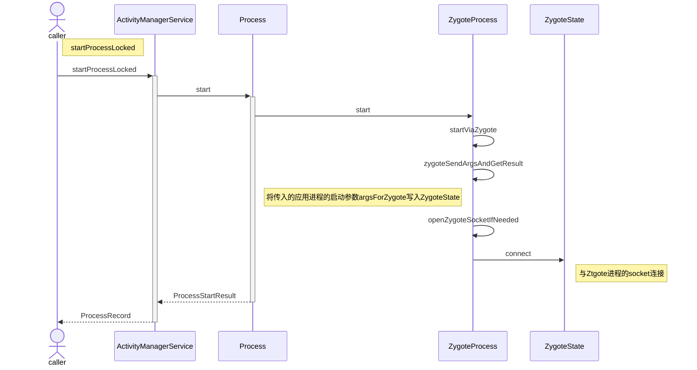
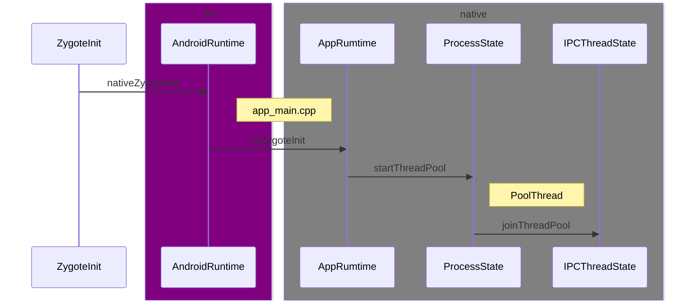
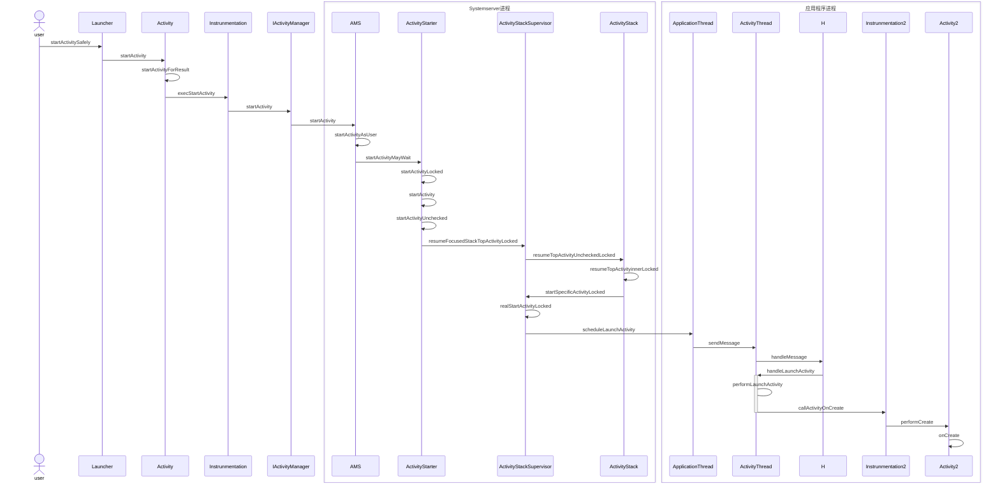

# 设备启动流程

## 启动电源以及系统启动

当电源按下时引导芯片代码从预定义的地方（固化在ROM）开始执行。加载引导程序BootLoader到RAM，然后执行  

## 引导程序BootLoader

引导程序BOotLoader是在Android操作系统开始运行前的一个小程序，它的主要作用是把系统OS拉起来并运行  

## Linux内核启动

当内核启动时，设置缓存、被保护存储器、计划列表、加载驱动。当内核完成系统设置时，它首先在系统文件中寻找init.rc文件，并启动init进程  

## init进程启动

初始化和启动属性服务，并启动Zygote进程  

## Zygote进程启动

创建Java虚拟机并为Java虚拟机注册JNI方法，创建服务器端Socket，启动SystemServer进程  

## SystemServer进程启动

启动Binder线程池和SystemServiceManager，并且启动各种系统服务  

## Launcher启动

## 启动流程图

# Launcher启动流程

1.  Launcher进程请求AMS；
2. AMS发送创建应用进程请求；
3. Zygote进程接受请求并孵化应用进程；
4. 应用进程启动ActivityThread；
5. 应用进程绑定到AMS；
6. AMS发送启动Activity的请求；
7. ActivityThread的Handler处理启动Activity的请求；

## 启动流程图

### Launcher进程请求AMS

### AMS发送创建应用进程请求

### Zygote进程接受请求并孵化应用进程

### 应用进程启动ActivityThread

## 应用程序Binder线程池创建过程

# 应用内启动流程
1. App进程通过AMS向system_server进程发送请求；
2. system_server进行准备工作处理（解析activity、启动参数处理）再通过Binder通知app进程；
3. app进程收到消息后创建activity，进入生命周期。
4. 

## 启动流程图

# 参考资料
[Activity的启动流程简述](https://blog.csdn.net/cpcpcp123/article/details/122055099)
[Activity的启动流程](https://blog.csdn.net/NakajimaFN/article/details/125916330)