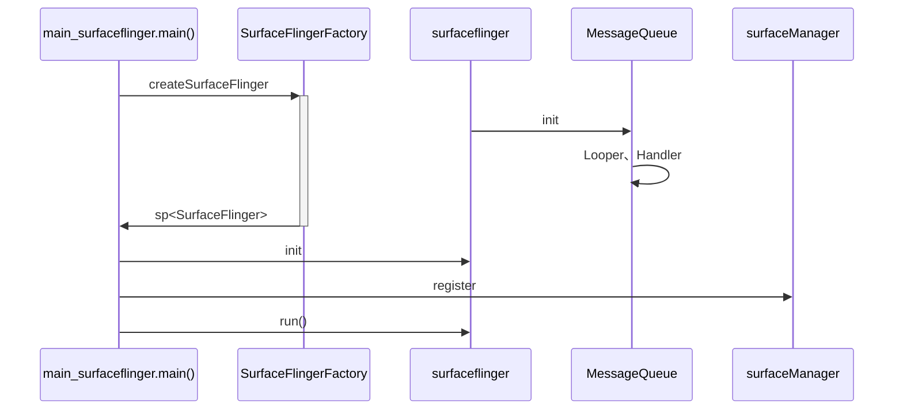

# SurfaceFlinger启动流程

```mermaid
sequenceDiagram

participant main as main_surfaceflinger.main()
participant factory as SurfaceFlingerFactory

main ->>+ factory : createSurfaceFlinger
surfaceflinger ->> MessageQueue : init
MessageQueue ->> MessageQueue : Looper、Handler
factory ->>- main : sp<SurfaceFlinger>

main ->> surfaceflinger : init
main ->> surfaceManager : register

main ->> surfaceflinger : run()

```

# 参考资料

[Android显示系统SurfaceFlinger详解 超级干货](https://blog.csdn.net/WolfKingzyh/article/details/135625212)

